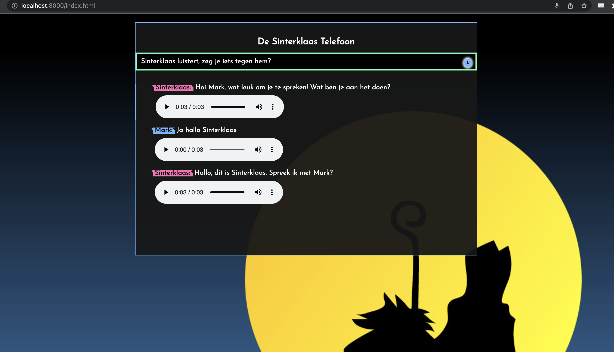

## Sint Bot
This is a basic front-end for a conversational agent that does:
1. Speech recognition (GCP speech recognition or Whisper via Replicate.ai)
2. Dialog generation (GPT-3 via OpenAI)
3. Speech synthesis (GCP speech synthesis)

## Run it
Make sure you have the API running too (https://github.com/vspruyt/sintapi)!
```bash
> npm run-script demo
```


# Screenshot


# Voice Activation Detection

Based on https://github.com/ricky0123/vad
